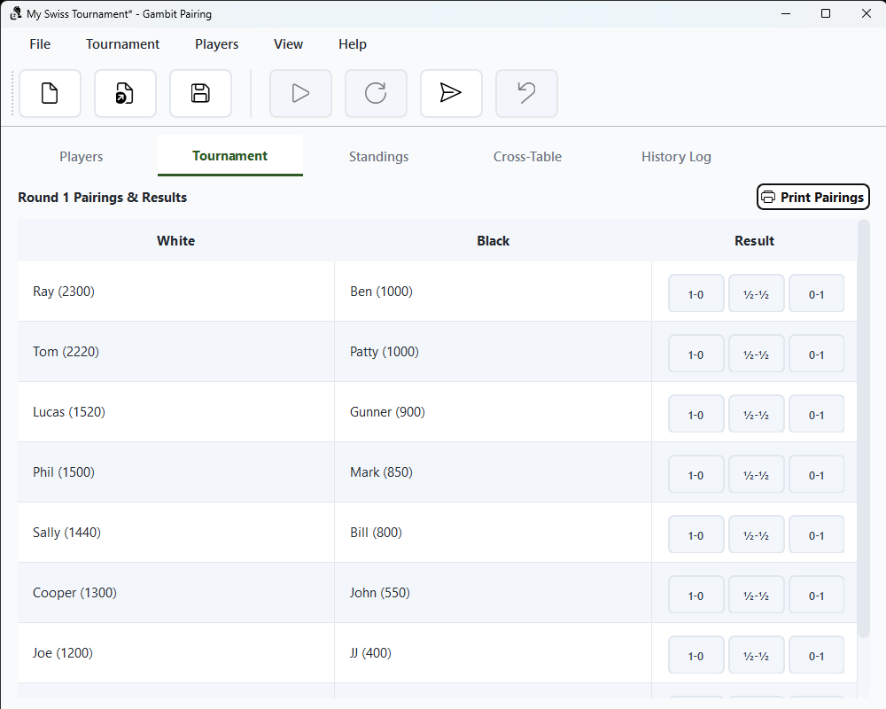
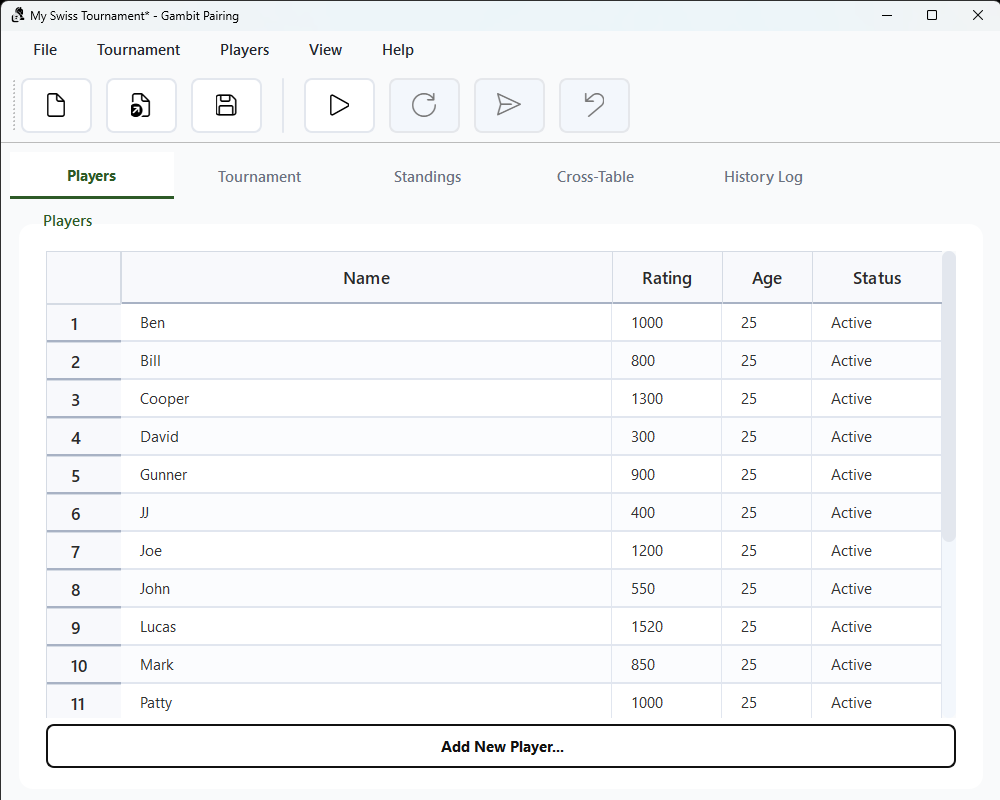
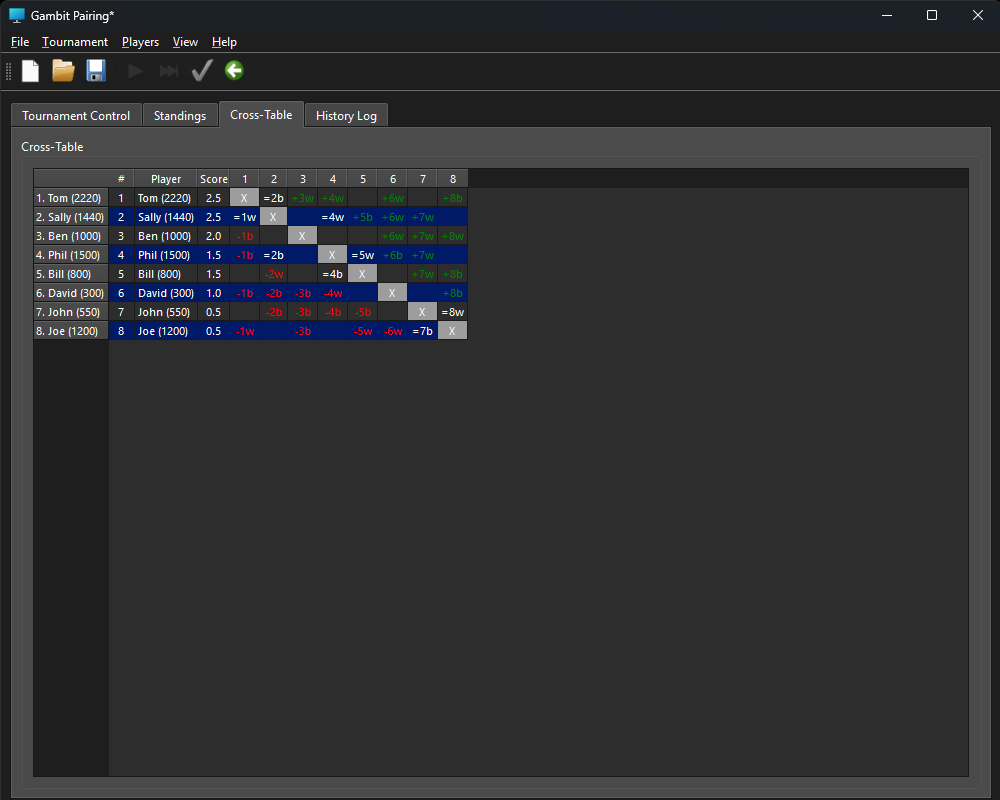
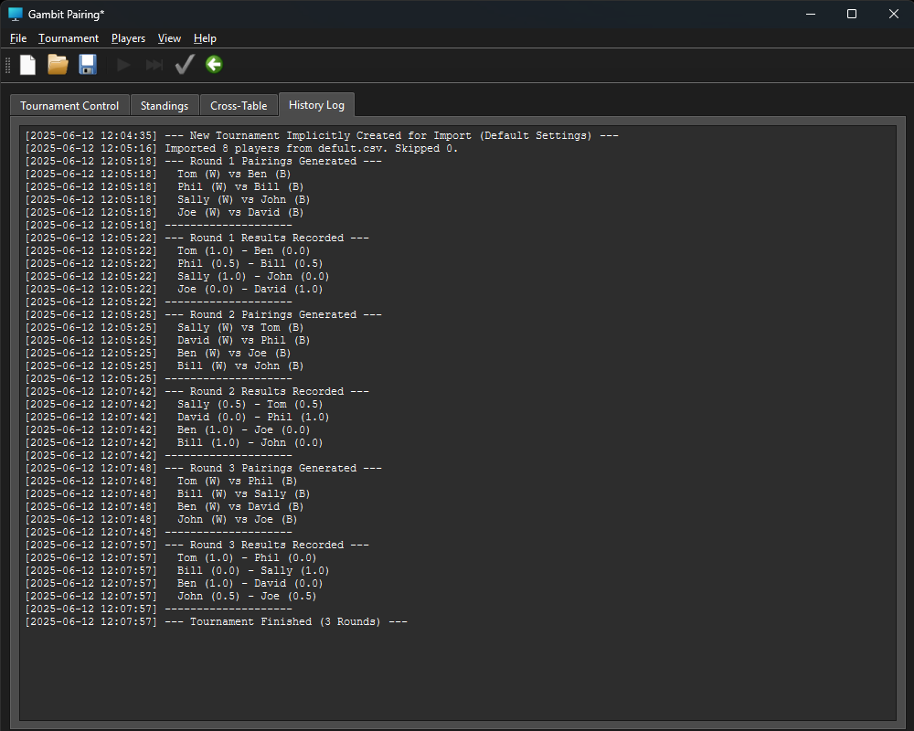
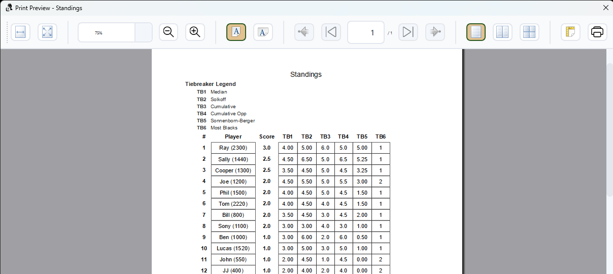

```
                                  $$\       $$\   $$\
                                  $$ |      \__|  $$ |
 $$$$$$\   $$$$$$\  $$$$$$\$$$$\  $$$$$$$\  $$\ $$$$$$\
$$  __$$\  \____$$\ $$  _$$  _$$\ $$  __$$\ $$ |\_$$  _|
$$ /  $$ | $$$$$$$ |$$ / $$ / $$ |$$ |  $$ |$$ |  $$ |
$$ |  $$ |$$  __$$ |$$ | $$ | $$ |$$ |  $$ |$$ |  $$ |$$\
\$$$$$$$ |\$$$$$$$ |$$ | $$ | $$ |$$$$$$$  |$$ |  \$$$$  |
 \____$$ | \_______|\__| \__| \__|\_______/ \__|   \____/
$$\   $$ |
\$$$$$$  |
 \______/
                    $$\           $$\
                    \__|          \__|
 $$$$$$\   $$$$$$\  $$\  $$$$$$\  $$\ $$$$$$$\   $$$$$$\
$$  __$$\  \____$$\ $$ |$$  __$$\ $$ |$$  __$$\ $$  __$$\
$$ /  $$ | $$$$$$$ |$$ |$$ |  \__|$$ |$$ |  $$ |$$ /  $$ |
$$ |  $$ |$$  __$$ |$$ |$$ |      $$ |$$ |  $$ |$$ |  $$ |
$$$$$$$  |\$$$$$$$ |$$ |$$ |      $$ |$$ |  $$ |\$$$$$$$ |
$$  ____/  \_______|\__|\__|      \__|\__|  \__| \____$$ |
$$ |                                            $$\   $$ |
$$ |                                            \$$$$$$  |
\__|                                             \______/

  __     _       _             _____  _____  _______
 / /    | |     | |           |  _  ||  ___||  _  \ \
| | __ _| |_ __ | |__   __ _  | |/' ||___ \ | |/' || |
| |/ _` | | '_ \| '_ \ / _` | |  /| |    \ \|  /| || |
| | (_| | | |_) | | | | (_| | \ |_/ //\__/ /\ |_/ /| |
| |\__,_|_| .__/|_| |_|\__,_|  \___(_)____(_)\___/ | |
 \_\      | |                                     /_/
          |_|
```
[](https://opensource.org/licenses/MIT)
[](https://www.python.org/)
[](https://riverbankcomputing.com/software/pyqt/intro)
[](https://discord.gg/eEnnetMDfr)

**Important:** Gambit Pairing is in alpha development (version 0.5.0). Features and stability are not guaranteed.

[Join our Discord](https://discord.gg/eEnnetMDfr)

Gambit Pairing is a desktop application for managing Swiss-system chess tournaments. It provides a modern graphical user interface (GUI) built with PyQt6, supporting USCF-style pairings, tiebreaks, and tournament management.

## Features

- **Modern User Interface**
  - Polished, high-contrast, accessible UI with custom stylesheets.
  - Tabbed interface: Players, Tournament Control, Standings, Cross-Table, History Log.
  - Tooltips, context menus, and responsive layouts.
  - Print preview dialogs for pairings and standings.

- **Player Management**
  - Add, edit, withdraw/reactivate, and remove players.
  - Manage detailed player info: name, rating, gender, date of birth, phone, email, club, federation.
  - Import/export player lists/details from/to CSV or text files.

- **Tournament Setup**
  - Configure number of rounds and tiebreak order (Median, Solkoff, Cumulative, etc.).
  - Save/load tournaments to/from disk (`.json` files, JSON format).
  - Full tiebreaker configuration with drag-and-drop order in settings.

- **Swiss Pairings**
  - Automated pairings for each round, avoiding rematches and balancing colors.
  - Manual adjustment of pairings before results are entered (with dialog).
  - Bye assignment according to USCF rules, including handling of inactive/withdrawn players.

- **Results Entry**
  - Enter round results via an interactive table with quick result buttons.
  - Auto-set results for inactive players.
  - Undo last round's results.

- **Standings & Tiebreaks**
  - Standings table with configurable tiebreak columns.
  - Cross-table view showing all results.
  - Tiebreaker legend in printouts.
  - Support for Median, Solkoff, Cumulative, Sonnenborn-Berger, Most Blacks, and more.

- **Print & Export**
  - Print pairings, standings, or player lists directly from the application.
  - Print preview and printer selection supported.
  - Export standings and player lists to CSV or text.

- **History & Logging**
  - Detailed history log of actions, pairings, and results.
  - Exportable log.
  - Logging to file and console for debugging.

- **Update Checker**
  - Built-in update checker for packaged releases.
  - Modern dialogs for update prompts and progress.
  - Automatic and manual update checks.

## Requirements
> see pyproject.toml
ie:

``` toml
[project]
name = "gambit-pairing"
version = "x.x.xxx"
dependencies = [ HERE ]
```

## Usage

1. Run the application:
   from src directory (after dependancies are installed):
    ```bash
    python ./gambitparing
    ```
    or if installed:
    ```bash
    gambit-pairing
    ```
2. **Create or Load a Tournament:**
    - Use "File > New Tournament..." or "File > Load Tournament..." to start.
    - Configure rounds and tiebreaks in "Settings".
3. **Add Players:**
    - Enter player details (name, rating, gender, etc.) and click "Add New Player...".
    - Import players from CSV via "File > Import Players from CSV...".
    - Edit, withdraw/reactivate, or remove players via right-click context menu.
4. **Start Tournament:**
    - Click "Start Tournament" when ready.
    - No further player additions/removals after starting.
5. **Pairings and Results:**
    - Prepare next round and enter results in the pairings table.
    - Use quick result buttons or select from the dropdown.
    - Manually adjust pairings if needed (right-click pairing row).
    - Undo last round's results if necessary.
6. **Standings & Cross-Table:**
    - View current standings and tiebreaks in the Standings tab.
    - View all results in the Cross-Table tab.
7. **Print:**
    - Print pairings, standings, or player lists via the "File > Print..." menu.
    - Use print preview and select your printer before printing.
8. **Export & Save:**
    - Export standings or player lists via the File menu.
    - Save or load tournaments at any time.
9. **History:**
    - Review all actions and results in the History Log tab.
10. **Check for Updates:**
    - Use "Help > Check for Updates..." to check for new versions (packaged releases only).

## Notes

- The pairing algorithm follows USCF-style Swiss rules, including color balancing and bye assignment.
- Tiebreak order is fully configurable and reflected in the standings and printouts.
- Manual pairing adjustments are logged and cannot be undone automatically.
- Tournament data is saved in `.json` files (JSON format).
- This is an alpha version (0.5.0); please report bugs or suggestions via [Discord](https://discord.gg/eEnnetMDfr) or make an issue on Github.

## License

This project is open source and available under the [MIT License](https://mit-license.org/).

## Screenshots

> _Below are some example screenshots of Gambit Pairing in action._

**Tournament Control Tab**


**Player Manager Tab**


**Standings Tab**


**Cross-Table Tab**


**History Log Tab**


**Print Dialog**

